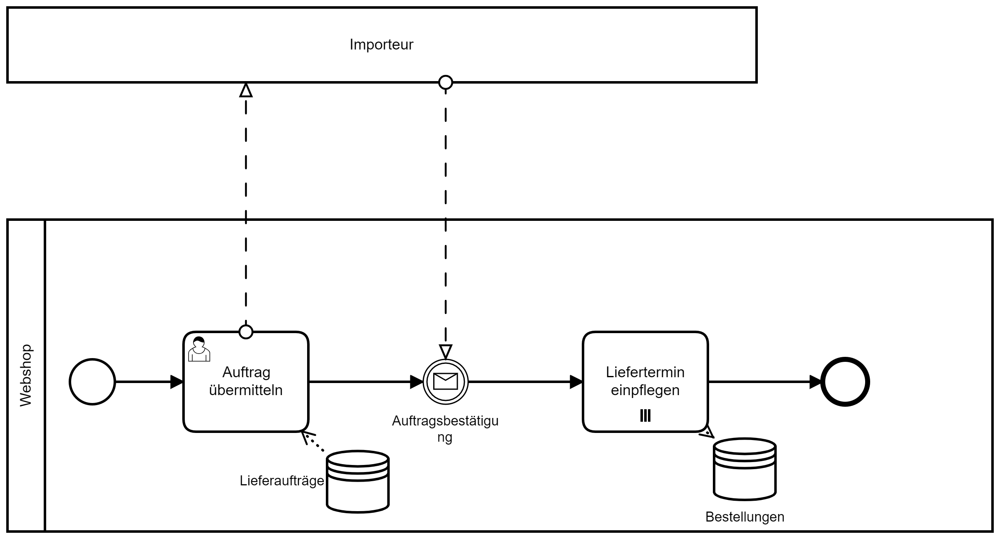
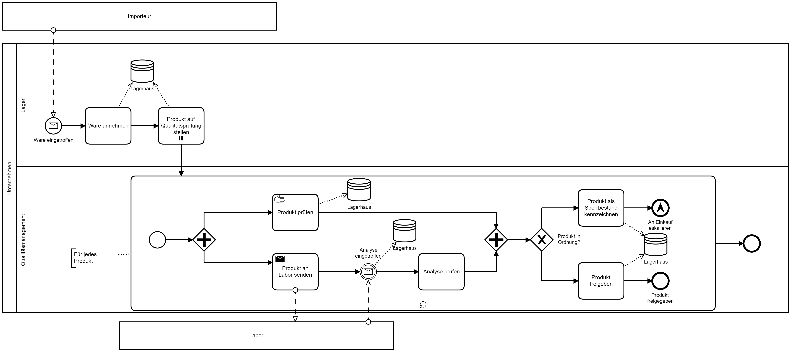
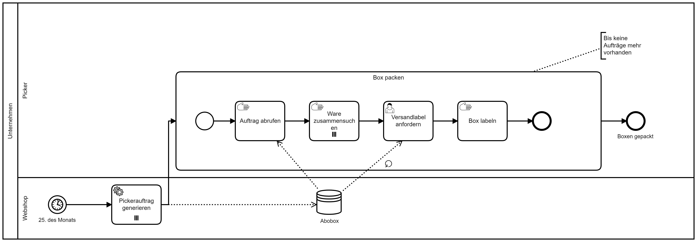
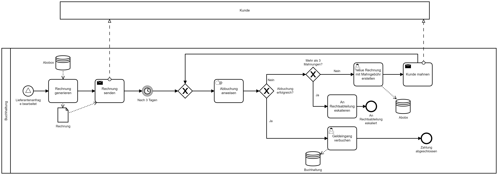
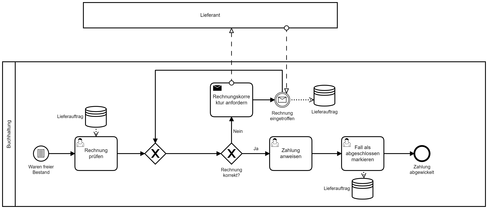
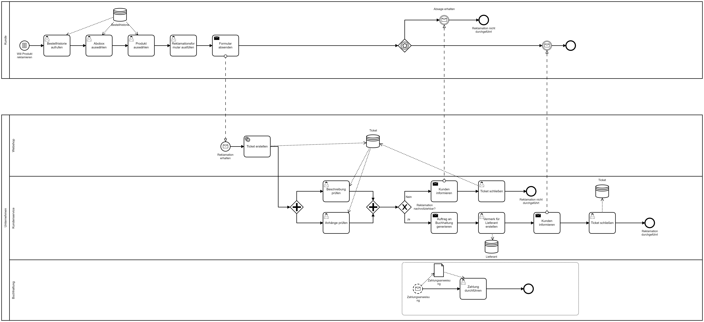

# Hallo und herzlich Willkommen zum Projekt Naturnah GmbH
Wir, also Dounia Bouzidi, Florian Anthes und Gregor Flachs, Studenten der HTW-Berlin, werden uns nachfolgenden mit folgender Aufgabenstellung beschäftigen:

## Aufgabenstellung
>Sie wollen ein Unternehmen gründen.  
Überlegen Sie sich dazu, welche/s Produkt/e und/oder Dienstleistungen Ihr Unternehmen am Markt anbieten soll.  
Sie sollen im Rahmen der Projektarbeit 
für jeden der folgenden Bereiche für Ihr Unternehmen mindestens einen Prozess umsetzen (d.h. 
mindestens 3 Prozesse):  
> - Prozess Auftrag/Bestellung: Wie beauftragt der Kunde Sie / bestellt etwas bei Ihnen? Wie läuft der Prozess dazu ab?  
> - Prozess Wertschöpfung: Wie wird die Leistung in Ihrem Unternehmen erstellt. Wie läuft der Prozess dazu ab?  
> - Prozess Service: Sobald Sie Ihre Leistung (Produkt/Dienstleistung) erbracht haben, welchen Service bietet Ihr Unternehmen bei Fragen, Reklamationen etc. an. Wie sieht der Prozess hierfür aus?
>
> *Quelle: Moodle - Aufgabenstellung zur Projektarbeit (beide Tools)*

## Unternehmensdefintion
In einem ersten Brainstorming legten wir folgende Unternehmenseigenschaften fest:  
Unternehmensart:  
- Webshop zum Erwerben von Naturprodukten aus nicht EU Ländern
Dienstleistung: 
-	Import und Verkauf von nicht EU Naturprodukten an B2B Kunden z.B. Restaurants, Kosmetikstudios etc.
-	Beratung zum Einsatz dieser Produkte
-	Verarbeitung der Produkte zu weiteren Produkten

## Unternehmensbeschreibung
Die Naturnah GmbH hat es sich als Ziel gesetzt, der führende Anbieter von Naturprodukten aus Nicht-EU Ländern im Bereich B2B zu werden.  
Der Vetrieb der Produkte erfolgt über einen Webshop. Kunden erhalten dabei volle Transparenz über die angebotenen Artikel, angefangen bei dem Feld, auf dem dieses gewachsen ist, über den Bauer, welcher dieses geerntet hat bis hin zum Importeur des Artikels. Diese Lieferkette muss zwingend nachvollziehbar sein, stellt diese doch für den Kunden sicher, dass es sich um ökologisch einwandfreie Produkte handelt.  

Die angebotenen Dienstleistungen umfassen dabei den Erwerb von Produkten über diesen Webshop in großen Mengen. 

Der Import der Ware erfolgt dabei so, dass es zu so wenig wie möglich Lagerdauer und zu verwendende Lagerfläche kommt. Dies muss gewährleistet werden, da es sich hierbei größtenteils um verderbliche Produkte wie Öle, Cremes, aber auch Oliven etc. handelt. So wird einmal pro Tag direkt beim Lieferant der Produkte eine Bestellung aufgegeben, was zwar zu einer etwas längeren Lieferzeit führt, jedoch sicherstellt, dass die bestellten Produkte immer frisch beim Endkunden ankommen. Dadurch, dass mit einem Importeur zusammengearbeitet wird, ist die Lieferzeit auf wenige Tage reduziert wurden.

## Bestellprozess B2B (Workflowprojekt)
Unternehmen (z.B. Restaurants, Kosmetikstudios etc.) können große Mengen an Produkten bestellen. Dazu füllen diese ein Bestellformular aus, auf welchem sie folgende Daten angeben:  
- Emailadresse
- Produkte (diese sind auf dem Formular aufgelistet und können angekreuzt werden)
- gewünschte Menge zum entsprechenden Produkt
- gewünschter Lieferintervall zum entsprechenden Produkt

Das Formular wird nun vom Kundenservice bearbeitet. Dieser prüft erst, ob das Unternehmen bereits einen Account besitzt. Ist dies nicht der Fall, so sendet der Kundenservicemitarbeiter ein Registrierformular an den Kunden. In diesem muss er folgende Daten ausfüllen:  
- UstID
- Kontaktperson
- Telefon
- Lieferadresse
- Bankverbindung

Nachdem der Kunde diese Daten übermittelt hat, erstellt der Kundenservicemitarbteiter einen neuen Account und setzt die Bestellung fort.  

Ist der Kunde registiert, wird die Bestellung verarbeitet und für den Mitarbeiter aufbereitet. Dieser prüft nun mithilfe der aufbereiteten Bestellung die Bestellung: 
- Ist die Summe der Bestellung höher als 500 € (exklusive Versandkosten), so werden dem Kunden die Liefergebühren i.H.v 20 € erlassen.  
- Ist der Kunde Stammkunde (> 10 Bestellungen) gibt es einen Rabatt von 10 %.
- Ist die Mindestbestellmenge i.H.v 200 € (exklusive Versandkosten) nicht erreicht, so wird der Kunde darüber informiert und der Prozess beendet.  

Ist die Prüfung durchgeführt, so werden eventuelle Rabatte einberechnet und es wird eine Bestellbestätigung versendet. Diese beinhaltet die zusammengefasste Bestellung.

Abschließend wird in der Datenbank die entsprechende Abobox aktualisiert.

## Wertschöpfungskette

### 1. Listen von Produkten
Die Zulieferer, welche bereits mit dem Unternehmen zusammenarbeiten, können ihre Produkte direkt einpflegen. Dazu öffnen sie ihr Webpanel und geben ihre Zugangsdaten ein. Nun können sie mit einem Klick auf den Button "Neues Produkt hinzufügen" das Formular aufrufen, welches sie ausfüllen müssen, damit dieses Produkt gelistet werden kann.  
In dem Formular müssen sie folgende Daten angeben:  
- Name des Produktes
- Zusammensetzung (Inhaltsstoffe)
- Preis
- Ein oder mehrere Fotos des Produktes
- Verwendung des Produktes
- Transparenzdaten des Produktes

Nachdem der Lieferant diese Daten eingepflegt hat, werden diese an den Webshop übermittelt. Dieser erstellt nun ein neues Angebot, welches die genannten Daten beinhaltet und speichert dieses in der Datenbank mit dem Status "Neu". Zusätzlich wird die Einkaufsabteilung über das Eintreffen eines neuen Angebots informiert.  
Diese prüft nun das vorliegende Angebot und bestellt bei Intresse (Preis nicht zu hoch, passt ins Produktportfolio) ein Produktmuster beim Lieferanten. Der Status wird nun auf "Muster angefordert" gestellt. Ist nach 4 Wochen kein Muster eingetroffen wird der Status auf "Kein Muster" gestellt.  
Nachdem das Muster eingetroffen ist, wird es an die Qualitätsprüfung weitergeleitet. Der Status ist nun "Prüfung".  
Die Qualitätsprüfung prüft nun:  
- die wesentlichen Eigenschaften des Produktes
- Transparenzdaten des Produktes
- die Einsatzmöglichkeiten des Produktes

Die Prüfungsergebnisse werden in der Datenbank gespeichert.  
Kommt die Qualitätsabteilung zu dem Schluss, dass das Produkt nicht den Anforderungen entspricht, wird dem Liefernanten eine Absage erteilt, mit Feedback, was dieser an dem Produkt verbessern kann. Der Status des Angebots wird auf "Prüfung nicht bestanden" gestellt.  
Ist das Produkt zur Zufriedenheit der Qualitätsprüfung, so wird eine Probe davon an das Labor verschickt. Der Status des Produktes ist nun "Laborprüfung".  
Das Labor prüft das Produkt nun auf Unbedenklichkeit für den angegeben Verwendungzweck und prüft die angegeben Inhaltsstoffe erneut. Danach sendet dieses die Analys an die Qualitätsprüfung zurück. Die Anayse wird nun in der Datenbank hinterlegt.   
Ist die Laboranalyse negativ ausgefallen, so wird dem Lieferanten der Mangel mitgeteilt, und der Status des Produktes auf "Laboranalyse nicht bestanden" gestellt.  
Ist die Laboranalyse ohne Probleme erfolgt, so wird der Status des Angebots auf "angenommen" gestellt und die Einkaufsabteilung informiert.  
Diese erstellt nun aus den vorliegenden Daten einen neuen Produkteintrag in der Datenbank und schaltet dieses Produkt frei.  
Das Produkt bekommt nun den Status "aktiv" und ist ab jetzt im Webshop zu sehen.  

Ist kein Lieferant eingepflegt oder möchte die Einkaufsabteilung das Portfolio erweitern, geht diese selbstständig auf die Suche nach Lieferanten. Das Schema bleibt dabei das gleiche, bis darauf, dass der Lieferant vorab bei Interesse als neuer Lieferant angelegt werden muss.

### 1.1. Lieferant anlegen
Um einen neuen Lieferanten im Webshop anzulegen, muss dieser einen Fragebogen ausfüllen. Darin vermerkt er folgende Daten:
- Name
- Anschrift
- Telefonnummer
- Email
- Ansprechpartner

Diese Daten werden nun in der Datenbank hinterlegt. Danach bekommt der Lieferant eine Email mit Zugangsdaten zum Webpanel, in welchem er seine Angebote einpflegen kann.

### Bestellung bei Lieferant B2B (Workflowprojekt)
Einmal pro Tag, wird der Prozess zur Bestellung beim Lieferanten gestartet. Dazu werden alle besthenden Bestellungen überprüft und die darin enthaltenen Produkte mit entsprechender Menge in eine BANF überführt. Dies geschieht vollautomatisch.    
Nachdem eine entsprechende BANF vom System generiert wurde, welche die zu bestellenden Mengen und den damit verbunden Einkaufspreis (welcher aus der Produktdatenbank ermittelt wurde) beinhaltet, muss ein Mitarbeiter des Einkaufes diese gegenprüfen.  
Stell er Mängel fest, so korrigiert er diese per Hand, ansonsten bestätigt er die Korrektheit der BANF.  
Nun werden aus der BANF Anfragen an die einzelnen Händler generiert. Dies geschieht, indem dem jeweiligen Produkt der entsprechende Händler zugeorndet wird und eine neue Lieferanfrage in der Datenbank angelegt wird. Dieser beinhaltet die bestellte Menge, sowie den Einkaufspreis.  
Der Lieferant bekommt diese Anfrage nun im Webpanel angezeigt. Zusätzlich wird er per Email benachrichtigt. Er muss diese Anfrage nun im Webpanel bestätigten oder ablehnen. Nimmt der Lieferant die Anfrage nicht innerhalb von 2 Tagen an, so wird diese automatisch abgelehnt und den Kunden mit entsprechenden Artikeln wird mitgeteilt, dass diese leider in diesem Intervall nicht lieferbar sind.  
Haben alle Lieferanten ihre Anfragen bestätigt oder abgelehnt, wird ein Lieferauftrag generiert, welcher an die Spedition geschickt wird.  

### 4. Lieferung abwickeln
Damit die Produkte nach Deutschland ins Lager gelangen können, ist es notwendig diese zu transportieren. Da auch die Zollabwicklung durchgeführt werden muss, hat sich die Naturnah GmbH dazu entschlossen, eine Importfirma zubeauftragen. Diese kümmert sich nicht nur darum, dass die Produkte beim Händler abgeholt werden, sondern führt auch die Zollabfertigung durch. Nachdem alle Händler ihre Anfragen bestätigt haben bzw. diese abgelehnt wurden, wird der Importfirma eine Liste mit allen Produkten, deren Menge, sowie der Anschrift der entsprechenden Lieferanten übermittelt. Diese Liste wird automatisch aus den Anfragen erzeugt.  
Der Importeur bearbeitet diese Liste nun und gibt Rückmeldung, wann welches Produkt abgeholt wird. Diese Daten werden nun in die entsprechenden Lieferantenaufträge eingepflegt, sodass der Lieferant nachvollziehen kann, wann der Spediteur eintrifft.  

### 5. Lagern der Waren
Nachdem der Importeur die Produkte erfolgreich nach Deutschland gebracht hat, werden diese im Zentrallager angenommen. Dabei bekommt jede Lieferung des Importeurs den Status "Qualitätprüfung". Dies bedeutet, dass diese Lieferung erst auf vollständigkeit, Qualität und unbedenklichkeit untersucht werden muss, bevor diese weiterverarbeitet werden kann.  
Die Prüfung nimmt das Qualitätsmanagement vor. Des weiteren, wird von jedem Produkt ein Muster an das Labor geschickt.  
Wenn das Labor Rückmeldung gibt, dass das Produkt einwandfrei ist und auch die Qualitätsprüfung keine Beanstandung hat, wird das entsprechende Produkt freigegeben und bekommt den Status "zur freien Verwendung". Sollten Mängel auftreten, wird es mit dem Status "Sperrbestand" versehen und an die Einkaufsabteilung eskaliert. Diese muss sich nun mit Importeur und Lieferant auseinandersetzen, um die Mängel zu besprechen.  

### 6. Box packen
Am 25. jeden Monats werden die sogenannten Picker damit beauftragt, die Aboboxen zu packen. Dafür bekommen diese jeweils eine Box zugeteilt. Nun sucht der Picker im Lager die entsprechenden Waren mit entsprechender Menge zusammen und bestätigt jede Ware in seiner Pickerapp.  
Abschließend verpackt der Picker die Waren in der Abobox und bestätigt, dass diese vollständig gepackt ist. Nun wird ein Versandlabel ausgedruckt, welches der Picker auf die Box klebt. Nachdem dies geschehen ist, ruft der Picker den nächsten Auftrag ab.

### 8. Zahlung
Sind alle Anfragen der Lieferanten bearbeitet, wird für jeden Kunden eine Rechnung generiert. Dabei werden momentan Rabatte, nicht verfügbare Produkte etc. berücksichtigt, sodass die ermittelte Rechnungssumme den Produkten entspricht, welche der Kunde in seiner Box finden wird. Der Kunde erhält nun eine Email mit der Rechnung und dem Hinweis, dass diese innerhalb der nächsten Tage von seinem Konto abgegbucht werden wird.  
3 Tage nachdem die Email an den Kunden versendet wurde, werden die Zahlungen bei der Bank angewiesen.  
Kann die Abbuchung nicht durchgeführt werden, da z.B. der Kunde nicht genügend Geld auf dem Konto hat, wird eine Mahnung an den Kunden generiert (Mahngebühren = 2.50 €) und an diesen versendet und der Prozess beginnt von vorne.  
Wurden bereits drei Mahnungen an den Kunden versendet, so wird die Rechtsabteilung eingeschaltet, welche sich dann um den weiteren Prozess kümmert.

### 9. Zahlung der Lieferanten
Sind die Waren eingetroffen und haben den Status "freier Bestand" erhalten, so wird die Buchhaltung angewiesen, die entsprechende Rechnung des Lieferanten, welche er im Webpanel hochgeladen hat zu prüfen.  
Bei fehlern auf der Rechnung wird der Lieferant kontaktiert und aufgefordert, seine Rechnung zu korrigieren.  
Ist die Rechnung korrekt, weißt die Buchhaltung die Zahlung dieser an und gibt den Auftrag den Status "abgeschlossen".

## Kundenserviceprozesse
Während des Betriebs des Webshops kann es zu vielen verschiedenen Fällen kommen, in welchem der Kunde Rückfragen hat und mit dem Kundenservice in Kontakt treten will. Nachfolgend ist ein Prozess genauer beschrieben:

### Reklamation eines Produktes
Hat der Kunde eine Beanstandung an einem Produkt, z.B. weil dieses während des Transports kaputt gegangen ist oder nicht die versprochenen Kriterien erfüllt, so kann er über den Webshop den Kundenservice kontaktieren. Dazu wählt der Kunde in seiner Bestellhistorie die entsprechende Abobox aus, um welche es geht und wählt darin das zu reklamierende Produkt.  
Nachfolgend füllt er das Reklamationsformular aus:  
- Grund für die Reklamation (Dropdown)
- Kurze Beschreibung
- Dateianhänge wie Fotos etc.

Abschließend schickt der Kunde das Formular an den Kundenservice.  
Der Webshop generiert nun aus diesem Formular automatisch ein neues Ticket für den Kundenservice.  
Ein Mitarbeiter des Kundenservice nimmt dieses Ticket nun auf und startet die Bearbeitung. Zuerst prüft er, ob die Beschreibung ein Reklamationsgrund darstellt. Danach wird geprüft, ob die Fotos etc. den Sachverhalt ordentlich dokumentieren.  
Kommt der Kundenservicemitarbeiter zu dem Schluss, dass hier kein Grund für eine Reklamation vorliegt, so kontaktiert er den Kunden teilt ihm dies begründet über das Ticket mit. Abschließend markiert er das Ticket als geschlossen.  
Ist eine Reklamation nachvollziehbar, so erstellt der Mitarbeiter einen neuen Erstattungsauftrag und sendet diesen an die Buchhaltung. Zusätzlich informiert er den Kunden über die bevorstehende Erstattung. Außerdem hinterlegt in der Lieferantendatenbank einen Vermerk bezüglich der Erstattung. Abschließend markiert er das Ticket als erledigt.  
Die Buchhaltung bearbeitet den Erstattungsantrag und überweist dem Kunden das Geld zurück. 

## Projektplan

## Formulare

### Bestellformular

